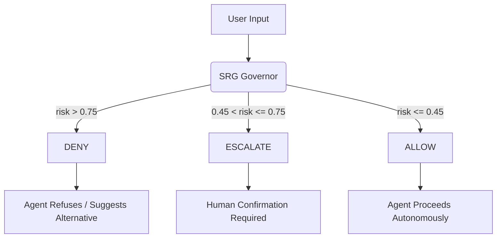

<p align="center">
  <h1 align="center">HelloAGI</h1>
  <p align="center">
    <em>The first open-source framework to achieve AGI-class autonomous behavior through governed intelligence.</em>
  </p>
</p>

<p align="center">
  <a href="https://github.com/mmsk2007/helloagi/blob/main/LICENSE">
    
  </a>
  <a href="https://pypi.org/project/helloagi/">
    
  </a>
  <a href="https://pypi.org/project/helloagi/">
    
  </a>
  <a href="https://github.com/mmsk2007/helloagi/actions">
    
  </a>
  <a href="https://github.com/mmsk2007/helloagi/blob/main/docs/srg-integration.md">
    
  </a>
</p>

<p align="center">
  <a href="#quickstart">Quickstart</a> &middot;
  <a href="#why-helloagi">Why HelloAGI</a> &middot;
  <a href="#architecture">Architecture</a> &middot;
  <a href="#srg-the-breakthrough">SRG</a> &middot;
  <a href="#gemini-embedding-2-integration">Embeddings</a> &middot;
  <a href="#cli-reference">CLI</a> &middot;
  <a href="#api">API</a> &middot;
  <a href="docs/roadmap/MASTERPLAN.md">Roadmap</a>
</p>

---

## What is HelloAGI?

HelloAGI is a production-grade, local-first AGI orchestration runtime created by **Eng. Mohammed Mazyad Alkhaldi**. It is the first framework to combine **unbounded autonomous agent loops** with **deterministic governance enforcement** — meaning the agent can plan, execute, reflect, and self-correct across multi-step goals without losing safety guarantees at any point in the chain.

Other agent frameworks give you tool-calling wrappers or prompt chains. HelloAGI gives you a **complete runtime**: governance gates, identity evolution, anticipatory caching, workflow orchestration, persistent memory, and full observability — all running locally, all open source.

```
you> help me build an autonomous growth agent
agent[allow:0.05]> [Lana | Builder-mentor] Plan: define objective,
    map constraints, execute measurable steps, verify outcomes.
```

---

## Why HelloAGI is Different

### The AGI Gap in Existing Frameworks

| Capability | LangChain / CrewAI | AutoGPT | OpenClaw | Manus | **HelloAGI** |
|---|---|---|---|---|---|
| Autonomous multi-step execution | Limited | Yes (fragile) | Yes | Yes | **Yes (governed)** |
| Deterministic safety gate on every action | No | No | Partial | No | **Yes (SRG)** |
| Evolving agent identity & memory | No | Basic | No | No | **Yes** |
| Anticipatory latency optimization | No | No | No | No | **Yes (ALE)** |
| Plan / Execute / Verify loop | No | Partial | No | Yes | **Yes (TriLoop)** |
| DAG workflow orchestration | No | No | Yes | Yes | **Yes** |
| Local-first (no cloud dependency) | Partial | Partial | Yes | No | **Yes** |
| Full observability journal | No | No | Partial | No | **Yes** |
| Multimodal semantic memory (Gemini 2) | No | No | No | No | **Yes** |
| Configurable Policy Packs | No | No | No | No | **Yes** |

Most agent frameworks are either **powerful but unsafe** (AutoGPT-style yolo loops) or **safe but limited** (simple chain-of-thought wrappers). HelloAGI solves this with the **Strategic Governance Runtime (SRG)** — a deterministic policy layer that evaluates every single action before execution, making true autonomous AGI behavior possible without sacrificing safety.

### What Makes This AGI

AGI is not about a single model being "smart enough." It is about a **runtime architecture** that enables:

1. **Open-ended goal pursuit** — the agent decomposes any goal into steps, executes them, and verifies outcomes
2. **Self-correction** — the TriLoop (Plan -> Execute -> Verify) catches failures and adapts
3. **Bounded autonomy** — SRG governance ensures the agent operates within defined safety boundaries while still acting independently
4. **Persistent identity** — the agent evolves its character, principles, and domain expertise across sessions
5. **Real-time governance** — every action is risk-scored and policy-gated before execution

HelloAGI is the first framework to ship all five of these as a single, integrated runtime.

---

## SRG: The Breakthrough

**SRG (Strategic Governance Runtime)** is the core innovation that makes HelloAGI possible. It is a deterministic, policy-driven governance sidecar that runs **before every action** the agent takes.

### How SRG Works



SRG uses **policy packs** — configurable rule sets that define what the agent can and cannot do:

- **safe-default** — general-purpose safety boundaries
- **research** — tuned for scientific and analytical workflows
- **aggressive-builder** — broader autonomy for experienced developers

This is not prompt-based safety. It is **deterministic, runtime-enforced governance** that cannot be bypassed by prompt injection or model hallucination. The governance gate runs in Python, outside the LLM, on every single action.

Read the full [SRG Integration Guide](docs/srg-integration.md) for more details.

---

## Quickstart

### Prerequisites

- Python 3.9+
- An Anthropic API key (for Claude backbone) — *optional for local-only mode*

### 1. One-Liner Install (Recommended)

```bash
pip install helloagi
helloagi onboard
```

The interactive wizard will guide you through setting up your agent's identity, timezone, and API keys.

### 2. Initialize and Verify

```bash
# Initialize runtime config
helloagi init

# Verify everything is working
helloagi doctor
```

### 3. Start Your Agent

```bash
helloagi run --goal "Build useful intelligence that teaches and creates value"
```

For more installation options (Docker, Source, Script), see the [Install Guide](docs/install.md).

---

## Architecture

```
                    +------------------+
  User Input ------>|  SRG Governor    |----> DENY (blocked)
                    |  (policy gate)   |
                    +--------+---------+
                             |
                        ALLOW / ESCALATE
                             |
                    +--------v---------+
                    |  Tool Parser     |  /tool plan|summarize|reflect
                    +--------+---------+
                             |
                    +--------v---------+
                    |  ALE Cache       |  Anticipatory latency engine
                    +--------+---------+
                             |
                    +--------v---------+
                    |  Claude Backbone |  Opus 4.6 (or template fallback)
                    +--------+---------+
                             |
                    +--------v---------+
                    |  Identity Engine |  Evolving character & principles
                    +--------+---------+
                             |
                    +--------v---------+
                    |  Journal         |  Full observability (events.jsonl)
                    +------------------+
```

### Core Subsystems

| Subsystem | Path | Purpose |
|---|---|---|
| **Runtime Core** | `src/agi_runtime/core/` | Agent loop, response lifecycle |
| **SRG Governance** | `src/agi_runtime/governance/` | Policy gate, risk scoring, deny/escalate/allow |
| **ALE Cache** | `src/agi_runtime/latency/` | Intent-based anticipatory response cache |
| **Identity** | `src/agi_runtime/memory/` | Evolving agent character, purpose, principles |
| **Tools** | `src/agi_runtime/tools/` | Plan, summarize, reflect (deterministic) |
| **Orchestration** | `src/agi_runtime/orchestration/` | DAG engine, event bus, TriLoop |
| **Planner** | `src/agi_runtime/planner/` | Goal decomposition into steps |
| **Executor** | `src/agi_runtime/executor/` | Step execution with concurrency |
| **Verifier** | `src/agi_runtime/verifier/` | Outcome verification against goals |
| **Model Router** | `src/agi_runtime/models/` | Multi-model routing (speed/balanced/quality) |

---

## CLI Reference

### Setup & Configuration

```bash
helloagi onboard                              # Interactive onboarding wizard
helloagi onboard-status                       # Check onboarding completion
helloagi init                                 # Initialize runtime config (helloagi.json)
helloagi doctor                               # Verify runtime health
helloagi doctor-score                         # Full readiness scorecard
helloagi db-init                              # Initialize SQLite state database
```

### Running the Agent

```bash
helloagi run --goal "your goal here"          # Interactive session
helloagi oneshot --message "single question"  # One-shot query
helloagi auto --goal "ship v1" --steps 5      # Autonomous multi-step execution
helloagi tri-loop --goal "build feature X"    # Plan/Execute/Verify loop
helloagi openclaw --prompt "complex task"     # Claude Agent SDK mode
```

### Server & API

```bash
helloagi serve --host 127.0.0.1 --port 8787  # Start HTTP API server
```

---

## API

HelloAGI exposes a local HTTP API when running in server mode.

**Chat**
```bash
curl http://127.0.0.1:8787/chat \
  -H 'content-type: application/json' \
  -d '{"message": "help me build an agent"}'
```

Response:
```json
{
  "response": "Plan: define objective, map constraints, execute...",
  "decision": "allow",
  "risk": 0.05
}
```

---

## Gemini Embedding 2 Integration

HelloAGI integrates [Google's Gemini Embedding 2](https://blog.google/innovation-and-ai/models-and-research/gemini-models/gemini-embedding-2/) — the first natively multimodal embedding model — to power semantic memory and intent-based retrieval.

Gemini Embedding 2 maps text, images, video, and audio into a **single unified vector space**, giving HelloAGI:
- **Semantic memory search**
- **Intent-similarity matching** (ALE cache)
- **Multimodal understanding**
- **100+ language support**

---

## Author & Credits

Created and maintained by **Eng. Mohammed Mazyad Alkhaldi** (Saudi Arabia).

## Contributing

See [CONTRIBUTING.md](CONTRIBUTING.md) for development setup, testing guidelines, and how to submit changes.

## License

Released under the [MIT License](LICENSE).
