# HelloAGI Architecture Audit — April 2026

> **Auditor**: Lead AI Systems Architect  
> **Date**: 2026-04-26  
> **Scope**: Full repository audit of `helloagi/` — structure, flow, SRG integration, strengths, weaknesses, and upgrade points.

---

## 1. Architecture Diagram

```mermaid
graph TD
    subgraph "User Entry Points"
        CLI["CLI (cli.py)"]
        API["HTTP API (api/server.py)"]
        TG["Telegram Channel"]
        DC["Discord Channel"]
        VOICE["Voice Channel"]
    end

    subgraph "HelloAGI Core"
        AGENT["HelloAGIAgent (core/agent.py)"]
        SYS_PROMPT["System Prompt Builder"]
        LLM_ROUTER["Model Router"]
        CLAUDE["Anthropic Claude Backend"]
        GEMINI["Google Gemini Backend"]
    end

    subgraph "SRG Governance Layer"
        SRG["SRGGovernor (governance/srg.py)"]
        MEM_GUARD["MemoryGuard (governance/memory_guard.py)"]
        OUT_GUARD["OutputGuard (governance/output_guard.py)"]
        POSTURE["PostureEngine (governance/posture.py)"]
        POLICY["PolicyPacks (policies/packs.py)"]
    end

    subgraph "Autonomy Layer"
        TRILOOP["TriLoop (autonomy/tri_loop.py)"]
        AUTO_LOOP["AutonomousLoop (autonomy/loop.py)"]
    end

    subgraph "Planning & Execution"
        PLANNER["Planner (planner/planner.py)"]
        EXECUTOR["Executor (executor/executor.py)"]
        VERIFIER["Verifier (verifier/verifier.py)"]
    end

    subgraph "Orchestration"
        ORCH["Orchestrator (orchestration/orchestrator.py)"]
        EVENT_BUS["EventBus (orchestration/event_bus.py)"]
        WORKFLOW["WorkflowGraph (workflows/graph.py)"]
    end

    subgraph "Tool System"
        TOOL_REG["ToolRegistry (tools/registry.py)"]
        BASH["bash_exec"]
        PYTHON["python_exec"]
        FILE_OPS["file_read/write/patch"]
        WEB["web_search/fetch"]
        SKILL_T["skill_create/invoke"]
        DELEGATE["delegate_task"]
        MEMORY_T["memory_store/recall"]
        REMIND["reminder_*"]
        SEND["send_file/image/voice"]
        ASK["ask_user"]
    end

    subgraph "Memory & Intelligence"
        IDENTITY["IdentityEngine (memory/identity.py)"]
        PRINCIPALS["PrincipalProfileStore (memory/principals.py)"]
        EMBEDDINGS["GeminiEmbeddingStore (memory/embeddings.py)"]
        COMPRESSOR["ContextCompressor (memory/compressor.py)"]
        SENTIMENT["SentimentTracker (intelligence/sentiment.py)"]
        CTX_COMP["ContextCompiler (intelligence/context_compiler.py)"]
        PATTERNS["PatternDetector (intelligence/patterns.py)"]
        CHAR_GEN["CharacterGenesis (memory/character_genesis.py)"]
    end

    subgraph "Skills"
        SKILL_MGR["SkillManager (skills/manager.py)"]
        SKILL_FILES["memory/skills/*.md"]
    end

    subgraph "Robustness"
        CB["CircuitBreaker (robustness/circuit_breaker.py)"]
        SUPERVISOR["Supervisor (supervisor/supervisor.py)"]
    end

    subgraph "Supporting Systems"
        ALE["ALEngine (latency/ale.py)"]
        JOURNAL["Journal (observability/journal.py)"]
        GROWTH["GrowthTracker (core/personality.py)"]
        STATE["StateStore (state/store.py)"]
    end

    CLI --> AGENT
    API --> AGENT
    TG --> AGENT
    DC --> AGENT
    VOICE --> AGENT

    AGENT --> SRG
    AGENT --> SYS_PROMPT
    AGENT --> LLM_ROUTER
    LLM_ROUTER --> CLAUDE
    LLM_ROUTER --> GEMINI
    AGENT --> TOOL_REG
    AGENT --> IDENTITY
    AGENT --> SKILL_MGR
    AGENT --> COMPRESSOR
    AGENT --> CB
    AGENT --> SUPERVISOR
    AGENT --> ALE
    AGENT --> JOURNAL
    AGENT --> GROWTH
    AGENT --> SENTIMENT
    AGENT --> CTX_COMP
    AGENT --> PATTERNS
    AGENT --> PRINCIPALS
    AGENT --> MEM_GUARD

    SRG --> POLICY
    TRILOOP --> SRG
    TRILOOP --> OUT_GUARD
    TRILOOP --> POSTURE
    TRILOOP --> PLANNER
    TRILOOP --> VERIFIER
    TRILOOP --> JOURNAL

    ORCH --> EXECUTOR
    ORCH --> EVENT_BUS
    ORCH --> WORKFLOW
    EXECUTOR --> TOOL_REG
    EXECUTOR --> SRG

    TOOL_REG --> BASH
    TOOL_REG --> PYTHON
    TOOL_REG --> FILE_OPS
    TOOL_REG --> WEB
    TOOL_REG --> SKILL_T
    TOOL_REG --> DELEGATE
    TOOL_REG --> MEMORY_T
    TOOL_REG --> REMIND
    TOOL_REG --> SEND
    TOOL_REG --> ASK
```

---

## 2. Module Inventory

| Module | Path | Lines | Responsibility |
|--------|------|-------|----------------|
| **Agent Core** | `core/agent.py` | ~1503 | Main agentic loop — `think()`, tool calling, LLM backends, system prompt |
| **SRG Governor** | `governance/srg.py` | 283 | Deterministic input + tool governance (allow/escalate/deny) |
| **MemoryGuard** | `governance/memory_guard.py` | 317 | Write-side memory sanitization (OWASP ASI06) |
| **OutputGuard** | `governance/output_guard.py` | 228 | Post-execution output scanning (secret leakage, phantom actions) |
| **PostureEngine** | `governance/posture.py` | ~200 | Runtime stance selection (conservative/balanced/aggressive) |
| **PolicyPacks** | `policies/packs.py` | ~100 | Swappable governance policy configs |
| **TriLoop** | `autonomy/tri_loop.py` | 486 | Plan → Execute → Verify → Replan with SRG gates |
| **AutonomousLoop** | `autonomy/loop.py` | 17 | Legacy repeater (backward compat shim) |
| **Planner** | `planner/planner.py` | 156 | LLM-powered task decomposition |
| **Executor** | `executor/executor.py` | 178 | Plan step execution with retries |
| **Verifier** | `verifier/verifier.py` | 133 | LLM/heuristic outcome verification |
| **Orchestrator** | `orchestration/orchestrator.py` | 352 | DAG-based workflow orchestration |
| **SkillManager** | `skills/manager.py` | 183 | Skill CRUD — markdown files with YAML frontmatter |
| **ToolRegistry** | `tools/registry.py` | ~250 | Tool registration, schema gen, execution dispatch |
| **CircuitBreaker** | `robustness/circuit_breaker.py` | 133 | Per-resource failure protection |
| **Supervisor** | `supervisor/supervisor.py` | 316 | Health monitoring, auto-pause, incident reports |
| **ContextCompressor** | `memory/compressor.py` | 143 | Conversation history compression |
| **ContextCompiler** | `intelligence/context_compiler.py` | 206 | Unified context snapshot builder |
| **SentimentTracker** | `intelligence/sentiment.py` | ~200 | Mood detection and guidance |
| **PatternDetector** | `intelligence/patterns.py` | ~300 | Behavioral pattern learning |
| **IdentityEngine** | `memory/identity.py` | ~150 | Agent identity evolution |
| **PrincipalProfileStore** | `memory/principals.py` | ~300 | Per-user profile management |
| **EmbeddingStore** | `memory/embeddings.py` | ~200 | Gemini-powered semantic memory |
| **CLI** | `cli.py` | ~1400 | Full CLI with init/run/serve/doctor/chat/tools |
| **Journal** | `observability/journal.py` | ~50 | JSONL event logging |

**Builtin Tools (27)**:
`ask_user`, `bash_exec`, `code_analyze`, `delegate_task`, `file_patch`, `file_read`, `file_search`, `file_write`, `memory_recall`, `memory_store`, `notify_user`, `python_exec`, `reminder_cancel`, `reminder_create`, `reminder_list`, `reminder_pause`, `reminder_resume`, `reminder_run_now`, `send_file_tool`, `send_image_tool`, `send_voice_tool`, `session_search`, `skill_create`, `skill_invoke`, `web_fetch`, `web_search`

---

## 3. Existing SRG Integration Summary

SRG is **deeply integrated** across HelloAGI. It is NOT a bolt-on:

### Input Gate
- Every `agent.think()` call evaluates user input through `SRGGovernor.evaluate(text)` before any LLM call
- Deny → immediate response, no LLM/tool execution
- Escalate → flags for human confirmation

### Tool Gate
- Every tool call goes through `SRGGovernor.evaluate_tool(name, input, risk_level)` 
- Dangerous commands (`rm -rf`, fork bombs, etc.) are blocked
- Sensitive file paths are flagged
- Network exfiltration attempts are detected
- Outbound file attachments are workspace-jailed, size-capped, and secret-name-rejected

### Output Gate (OutputGuard)
- Post-execution scanning for secret leakage (API keys, private keys, JWTs, etc.)
- Phantom action detection (LLM claims action without tool calls)
- Used by TriLoop on every step output

### Memory Gate (MemoryGuard)
- Every memory write is sanitized before persistence
- Prompt injection phrases are redacted or denied
- Secret patterns are caught as defense-in-depth
- Goal-altering directives are denied for identity/principle memories
- Density threshold prevents adversarial flooding

### Posture System
- `PostureEngine` derives runtime stance per goal (conservative/balanced/aggressive)
- Posture scales risk thresholds, replan budget, failure tolerance
- Bias can only make posture stricter, never looser

### TriLoop Integration
- Pre-flight SRG evaluation of goals
- Plan review by SRG (when posture requires)
- Per-step SRG evaluation
- OutputGuard on every step output
- Full journal audit trail

### Policy Packs
- Swappable governance configs (safe-default, research, aggressive-builder)
- Control deny/escalate keywords, model tier, identity traits, autonomy budget
- Tool allow/block lists per pack

---

## 4. Current Strengths

1. **SRG Governance is Real** — Not just docs. Every tool call genuinely passes through deterministic Python gates. This is HelloAGI's genuine moat.

2. **Multi-LLM Support** — Anthropic Claude and Google Gemini with intelligent routing, fallback, and exponential backoff with resilience.

3. **TriLoop Architecture** — Proper Plan → Execute → Verify → Replan cycle with SRG at every gate. This is production-grade autonomous execution.

4. **Four-Layer Governance** — Input (SRG), Tool (SRG), Output (OutputGuard), Memory (MemoryGuard). Defense-in-depth.

5. **Rich Tool System** — 27 builtin tools with risk levels, per-tool governance, and principal-aware context.

6. **Multi-Channel** — CLI, HTTP API, Telegram, Discord, Voice — all SRG-protected.

7. **Memory System** — Semantic embeddings (Gemini), text fallback, principal-scoped, MemoryGuard-sanitized.

8. **Personality & Intelligence** — Growth tracking, sentiment analysis, pattern detection, context compilation, identity evolution.

9. **Sub-Agent Delegation** — Isolated sub-agents for delegated tasks, also SRG-governed.

10. **Circuit Breaker + Supervisor** — Robust failure handling with auto-pause and incident reporting.

---

## 5. Current Weaknesses

1. **Skill System is Primitive** — Only stores name/description/triggers/steps as markdown. No skill scoring, versioning, success/failure tracking, confidence, decay, or preconditions. Skill matching is simple keyword overlap with no semantic search.

2. **No Skill Extraction from Task Traces** — Skills must be manually created via `skill_create` tool. No automatic discovery from successful task completions.

3. **No Completion Verification in Main Loop** — The TriLoop has a Verifier, but the main `agent.think()` loop does NOT verify completion before responding. The agent can claim success without evidence.

4. **No Loop Detection in Main Loop** — CircuitBreaker prevents tool-level loops, but there's no detection of the agent repeating the same failed strategy across turns.

5. **No Recovery Strategy** — When a tool fails, the agent retries (Executor has backoff), but there's no strategy switching, search fallback, or alternative approach suggestion.

6. **Context Management is Basic** — `ContextCompressor` does simple turn-count compression. No structured rolling context, no memory relevance scoring, no context unrolling strategy.

7. **TriLoop Not Used by Default** — The main `agent.think()` path doesn't use TriLoop. It's an opt-in module. Most users interact via `think()` directly.

8. **No Task Trace Logging** — The Journal logs events but there's no structured task trace that records the full decision→action→outcome chain for later learning.

9. **No Skill Refinement** — No mechanism to improve skills based on repeated usage or failure patterns.

10. **SRG Governance Doesn't Log Governance Decisions Separately** — Governance results are logged as part of other events, not as first-class governance records.

---

## 6. Missing Systems

| System | Status | Impact |
|--------|--------|--------|
| **Co-Evolving Skill Bank** | ❌ Missing | Agent cannot learn from experience automatically |
| **Skill Contracts** | ❌ Missing | No formal skill specification with preconditions/postconditions |
| **Completeness Verifier (in main loop)** | ❌ Missing | Agent can claim false success |
| **Loop Breaker (in main loop)** | ❌ Missing | Agent can repeat failed strategies |
| **Recovery Manager** | ❌ Missing | No strategy switching on failure |
| **Search Fallback** | ⚠️ Partial (web_search exists) | No automatic escalation to search on unfamiliar tasks |
| **Structured Context Builder** | ⚠️ Partial (ContextCompiler exists) | Not used in main prompt building |
| **Memory Relevance Scoring** | ⚠️ Partial (embedding similarity) | No dynamic relevance based on task type |
| **Governance Logger** | ⚠️ Partial (events logged) | No dedicated governance audit trail |
| **Skill Scoring/Decay** | ❌ Missing | No confidence scoring or stale skill retirement |
| **Task Trace Logger** | ❌ Missing | Cannot extract skills from past tasks |
| **End-to-End Tests** | ⚠️ Partial | Tests exist but no multi-step scenario tests |
| **Benchmark Runner** | ❌ Missing | No framework for comparing against competitors |

---

## 7. Risky Areas — Do Not Break

> [!CAUTION]
> These areas are critical working infrastructure. Any changes must preserve their behavior:

1. **`SRGGovernor.evaluate()` and `evaluate_tool()`** — The heart of safety. Do not modify risk scoring, thresholds, or decision logic without extensive testing.

2. **`HelloAGIAgent.think()` / `_think_async()`** — The main agentic loop. All 1500 lines are load-bearing. Extend, don't rewrite.

3. **`MemoryGuard.inspect()`** — OWASP ASI06 mitigation. Any change could open a memory poisoning vector.

4. **`OutputGuard.inspect()`** — Secret leakage defense. Pattern changes need careful review.

5. **Tool execution flow** — `_execute_tool()` → `set_tool_context()` → `registry.execute()` → `reset_tool_context()`. The context management is subtle.

6. **Conversation history management** — Per-principal `_histories` dict with `contextvars`. Threading model is important.

7. **LLM backbone selection** — `_configure_llm_backbone()` and auto-selection logic. Breaking this breaks all LLM features.

8. **Policy pack system** — `_allowed_tool()`, `_build_policy_pack_section()`. Policy enforcement across tools.

---

## 8. Recommended Upgrade Points

### Priority 1: Skill System Enhancement (COSPLAY-inspired)
- **Where**: `skills/manager.py` → new `skills/` modules
- **What**: Add Skill contracts, scoring, versioning, extraction, refinement
- **Risk**: Low — additive to existing SkillManager
- **SRG integration**: Skills need risk levels, skill_create governed

### Priority 2: Completion Verification (VLAA-inspired)
- **Where**: Hook into `_think_async_claude()` / `_think_async_gemini()` response path
- **What**: Completeness verifier that blocks false completion claims
- **Risk**: Medium — modifies main response path
- **SRG integration**: Verification results as governance signals

### Priority 3: Loop Detection & Recovery (VLAA-inspired)
- **Where**: New `reliability/` module, hooked into think loop
- **What**: Detect repeated strategies, break loops, switch approaches
- **Risk**: Medium — adds new decision point in main loop
- **SRG integration**: Strategy switches as governed decisions

### Priority 4: Context Management (ContextPaper-inspired)
- **Naming**: This roadmap item refers to **ContextPaper**-style structured long-context handling (rolling windows, relevance scoring, unrolling). It is **not** a bundled repository in this monorepo; searches for a folder named `contextpapet` are usually a typo for **ContextPaper** or this priority block.
- **Where**: Extend `memory/compressor.py` and `intelligence/context_compiler.py`
- **What**: Structured rolling context, memory relevance scoring, context unrolling
- **Risk**: Low-Medium — mostly affects system prompt construction
- **SRG integration**: Context selection as governance-aware

### Priority 5: Governance Logging
- **Where**: New `governance/governance_logger.py`
- **What**: Dedicated governance audit trail, risk labels, approval gates
- **Risk**: Low — purely additive observability
- **SRG integration**: IS the SRG integration enhancement

### Priority 6: Task Trace System
- **Where**: New module that wraps think loop
- **What**: Structured task traces for skill extraction
- **Risk**: Low — additive logging
- **SRG integration**: Traces include governance decisions

---

## 9. Test Coverage Assessment

**Existing Test Directories** (14 subdirectories + 26 test files):
- `tests/architecture/` — Architecture-level tests
- `tests/autonomy/` — TriLoop tests
- `tests/channels/` — Channel tests  
- `tests/core/` — Core agent tests
- `tests/diagnostics/` — Diagnostic tests
- `tests/e2e/` — End-to-end tests
- `tests/governance/` — SRG/OutputGuard/PostureEngine tests
- `tests/memory/` — Memory system tests
- `tests/models/` — Model routing tests
- `tests/orchestration/` — Orchestrator tests
- `tests/reminders/` — Reminder tests
- `tests/robustness/` — Circuit breaker tests
- `tests/storage/` — State storage tests

**Notable test files**: `test_governance.py`, `test_skills.py`, `test_supervisor.py`, `test_circuit_breaker.py`, `test_openclaw_bridge.py`, `test_intelligence.py`

**Gaps**: No multi-step scenario tests, no competitor comparison tests, no skill reuse tests, no recovery tests.

---

## 10. Configuration Files

| File | Purpose |
|------|---------|
| `helloagi.json` | Agent identity, mission, LLM config |
| `helloagi.onboard.json` | Setup state, providers, channels, extensions |
| `pyproject.toml` | Package metadata, dependencies, entry points |
| `.env` / `.env.example` | API keys, tokens |
| `Dockerfile` | Container config |
| `Makefile` | Dev commands |
| `pytest.ini` | Test config |

---

## Summary

HelloAGI is a **substantially built** autonomous agent framework with real SRG governance, multi-LLM support, a rich tool system, and sophisticated memory/intelligence layers. The architecture is genuine and working — it is not a prototype.

The main upgrade opportunities are:
1. **Skill evolution** — making the agent learn from experience (COSPLAY)
2. **Execution reliability** — preventing false completions and loops (VLAA)
3. **Context intelligence** — structured, relevance-scored context management (ContextPaper)
4. **Governance deepening** — dedicated logging, risk labels on skills (SRG)

All upgrades should be **additive** to the existing architecture, not rewrites.
