# HelloAGI Target Architecture — Post-Upgrade

> **Version**: 0.6.0 (Target)
> **Status**: Design Document — Pending Approval

---

## 1. Architecture Overview

```mermaid
graph TD
    subgraph "Agent Core (Existing + Enhanced)"
        AGENT["HelloAGIAgent"]
        PLANNER["Planner"]
        EXECUTOR["Executor"]
        VERIFIER["Verifier (Enhanced)"]
        REFLECTOR["Reflector (New)"]
        MEM_MGR["Memory Manager (Enhanced)"]
        SKILL_MGR["Skill Manager (Enhanced)"]
        SRG_GOV["SRG Governor (Existing)"]
        RECOVERY["Recovery Manager (New)"]
        CTX_MGR["Context Manager (New)"]
        TOOL_ROUTER["Tool Router (Existing ToolRegistry)"]
    end

    subgraph "Co-Evolving Skill System (New)"
        SKILL_BANK["Skill Bank"]
        SKILL_EXTRACT["Skill Extractor"]
        SKILL_EVAL["Skill Evaluator"]
        SKILL_RETRIEVE["Skill Retriever"]
        SKILL_SCHEMA["Skill Contracts"]
    end

    subgraph "VLAA Reliability Layer (New)"
        COMP_VERIFY["Completeness Verifier"]
        LOOP_BREAK["Loop Breaker"]
        STOP_VALID["Stop Validator"]
        STRAT_SWITCH["Strategy Switcher"]
    end

    subgraph "Context Unrolling Layer (New)"
        CTX_BUILD["Context Builder"]
        CTX_UNROLL["Context Unroller"]
        MEM_SELECT["Memory Selector"]
        CTX_COMPRESS["Context Compressor (Enhanced)"]
    end

    subgraph "SRG Governance Layer (Enhanced)"
        SRG["SRGGovernor"]
        OUT_GUARD["OutputGuard"]
        MEM_GUARD["MemoryGuard"]
        POSTURE["PostureEngine"]
        GOV_LOG["Governance Logger (New)"]
        SRG_ADAPT["SRG Adapter (New)"]
    end

    AGENT --> SKILL_MGR
    AGENT --> RECOVERY
    AGENT --> CTX_MGR
    AGENT --> COMP_VERIFY
    AGENT --> LOOP_BREAK

    SKILL_MGR --> SKILL_BANK
    SKILL_MGR --> SKILL_EXTRACT
    SKILL_MGR --> SKILL_EVAL
    SKILL_MGR --> SKILL_RETRIEVE

    CTX_MGR --> CTX_BUILD
    CTX_MGR --> MEM_SELECT
    CTX_MGR --> CTX_COMPRESS

    COMP_VERIFY --> STOP_VALID
    LOOP_BREAK --> STRAT_SWITCH
    STRAT_SWITCH --> RECOVERY

    SRG_ADAPT --> SRG
    SRG_ADAPT --> GOV_LOG
    GOV_LOG --> JOURNAL["Journal"]
```



---

## 2. Co-Evolving Skill System

### Skill Contract Schema

```python
@dataclass
class SkillContract:
    skill_id: str              # UUID
    name: str                  # Human-readable name
    description: str           # What this skill does
    task_type: str             # "file_ops", "web_research", "coding", etc.
    preconditions: List[str]   # When to use this skill
    execution_steps: List[str] # How to execute
    tools_required: List[str]  # Which tools needed
    expected_observations: List[str]  # What to expect during execution
    success_criteria: List[str]      # How to verify success
    failure_modes: List[str]         # Known failure patterns
    recovery_strategy: str           # What to do on failure
    confidence_score: float          # 0.0-1.0 reliability rating
    usage_count: int                 # Total invocations
    success_count: int               # Successful completions
    failure_count: int               # Failed attempts
    last_used_at: float              # Timestamp
    created_from_task_id: str        # Source task trace
    srg_risk_level: str              # "low", "medium", "high"
    version: int                     # Schema version for evolution
    tags: List[str]                  # Searchable tags
    created_at: float
    updated_at: float
```

### Skill Bank Components

- **skill_schema.py** — SkillContract dataclass, serialization, validation
- **skill_bank.py** — Storage, CRUD, versioning, decay management
- **skill_retriever.py** — Semantic search via embeddings, relevance scoring
- **skill_extractor.py** — Extract skills from successful TriLoop traces
- **skill_evaluator.py** — Score skills, apply decay, promote/retire

### Skill Lifecycle
1. **Discovery** — TriLoop completes successfully → extractor identifies reusable pattern
2. **Creation** — Skill contract created with initial confidence from success criteria
3. **Storage** — Stored in skill bank with SRG risk assessment
4. **Retrieval** — Semantic search matches skill to new task
5. **Invocation** — Skill steps injected into planning/system prompt
6. **Scoring** — Success/failure tracked → confidence updated
7. **Refinement** — Failed invocations update failure_modes and recovery_strategy
8. **Decay** — Unused skills lose confidence over time
9. **Retirement** — Below-threshold skills are archived

---

## 3. VLAA Reliability Layer

### Completeness Verifier
Hooks into `_think_async` response path:
- After LLM generates final response (no tool calls), check:
  - `tool_calls_made > 0` if response claims action taken
  - OutputGuard phantom action patterns
  - File existence checks for "I created the file" claims
  - Command output consistency for "I ran the command" claims
- Returns: `verified` | `unverified` | `phantom`
- Unverified → inject "please verify your claim" into next turn
- Phantom → block response, request actual tool execution

### Loop Breaker
Monitors `_session_tool_calls` per principal:
- Detect: same tool + same args called 3+ times
- Detect: same error message repeated
- Detect: LLM response similarity above threshold
- On detection: inject recovery instruction, break current approach

### Recovery Manager
When loop or failure detected:
1. Log failure pattern
2. Suggest alternative approach in system prompt
3. If alternatives exhausted → escalate to user via `ask_user`
4. Track recovery attempts to prevent meta-loops

### Stop Validator
Before `AgentResponse` is returned with task-complete claims:
- Check: was the stated goal addressed?
- Check: are there observable artifacts?
- Check: SRG approves the completion
- If not verified: append uncertainty disclaimer

---

## 4. Context Unrolling Layer

### Context Segment Types
```python
class ContextSegment:
    type: str          # "task", "session", "memory", "skills", "risk", etc.
    priority: int      # 1-10, higher = more important
    content: str
    max_tokens: int
    relevance_score: float  # 0-1, dynamic per request
```

### Context Builder
Replaces ad-hoc system prompt construction:
1. Collect all segments (task, memory, skills, patterns, risk state)
2. Score each by relevance to current request
3. Sort by priority × relevance
4. Assemble within token budget
5. Compress lower-priority segments if over budget

### Memory Selector
Enhanced memory retrieval:
- Embedding similarity (existing)
- Recency boost (newer memories score higher)
- Principal scope (existing)
- Task-type relevance (coding tasks prefer code memories)
- Usage frequency (frequently retrieved memories score higher)

---

## 5. SRG Governance Layer (Enhanced)

### What SRG Must Govern (Complete List)

| Action | Governance Type | Gate |
|--------|----------------|------|
| User input | evaluate() | Input SRG |
| Tool execution | evaluate_tool() | Tool SRG |
| Agent output | OutputGuard.inspect() | Output Guard |
| Memory write | MemoryGuard.inspect() | Memory Guard |
| Skill creation | evaluate_tool() on skill content | Tool SRG |
| Skill promotion | evaluate() on skill description | Input SRG |
| Completion claim | stop_validator check | New gate |
| Strategy switch | evaluate() on new approach | Input SRG |
| Sub-agent delegation | evaluate_tool() on goal | Tool SRG |
| External side effects | evaluate_tool() | Tool SRG |

### SRG Output Types (Enhanced)

| Decision | When Used |
|----------|-----------|
| `allow` | Low risk, proceed |
| `deny` | High risk, block |
| `escalate` | Medium risk, ask user (existing) |
| `require_more_evidence` | Unverified completion claim (new) |
| `reduce_scope` | Allow with limitations (new) |
| `ask_for_confirmation` | Explicit user approval needed (new) |

### Governance Logger
Dedicated audit trail for all governance decisions:
```python
@dataclass
class GovernanceRecord:
    timestamp: float
    decision: str
    risk: float
    gate: str           # "input", "tool", "output", "memory", "completion"
    reasons: List[str]
    action_summary: str
    principal_id: str
    outcome: str        # "proceeded", "blocked", "user_approved", "user_denied"
```

---

## 6. Module Structure

```
helloagi/src/agi_runtime/
├── skills/                    # Enhanced
│   ├── __init__.py
│   ├── manager.py             # Enhanced SkillManager
│   ├── skill_schema.py        # NEW — SkillContract dataclass
│   ├── skill_bank.py          # NEW — Storage, CRUD, versioning
│   ├── skill_retriever.py     # NEW — Semantic search
│   ├── skill_extractor.py     # NEW — Extract from traces
│   └── skill_evaluator.py     # NEW — Scoring, decay, lifecycle
│
├── reliability/               # NEW
│   ├── __init__.py
│   ├── completion_verifier.py # Completeness verification
│   ├── loop_breaker.py        # Loop detection and breaking
│   ├── recovery_manager.py    # Strategy switching
│   └── stop_validator.py      # Stop condition validation
│
├── context/                   # NEW
│   ├── __init__.py
│   ├── context_manager.py     # Main context orchestrator
│   ├── context_unroller.py    # Structured context assembly
│   ├── memory_selector.py     # Relevance-scored memory retrieval
│   └── context_compressor.py  # Enhanced progressive compression
│
├── governance/                # Enhanced
│   ├── __init__.py
│   ├── srg.py                 # EXISTING — no changes
│   ├── memory_guard.py        # EXISTING — no changes
│   ├── output_guard.py        # EXISTING — no changes
│   ├── posture.py             # EXISTING — no changes
│   ├── policy_loader.py       # EXISTING — no changes
│   ├── srg_adapter.py         # NEW — unified governance interface
│   └── governance_logger.py   # NEW — dedicated audit trail
│
├── evaluation/                # NEW
│   ├── __init__.py
│   ├── scenarios.py           # Test scenario definitions
│   ├── benchmark_runner.py    # Run and score scenarios
│   └── hermes_openclaw_comparison.py  # Competitor comparison
```

---

## 7. Integration Strategy

### Non-Breaking Approach
All new modules are **additive**. The existing `agent.think()` path continues to work exactly as before. New features are:

1. **Opt-in initially** — New features can be enabled via config flags
2. **Gradual integration** — Hook into existing events/callbacks
3. **Backward compatible** — Old SkillManager API preserved
4. **SRG-first** — Every new feature flows through governance

### Hook Points in Existing Code

| Module | Hook Point | What It Does |
|--------|-----------|-------------|
| Completion Verifier | After final response in `_think_async_*` | Validates completion claims |
| Loop Breaker | Before LLM call in each turn | Checks for repetition patterns |
| Context Manager | In `_build_system_prompt()` | Replaces ad-hoc context assembly |
| Skill Retriever | In `_build_system_prompt()` skills section | Semantic skill matching |
| Skill Extractor | After successful TriLoop run | Extracts skills from traces |
| Governance Logger | In all SRG evaluate methods | Records governance decisions |
